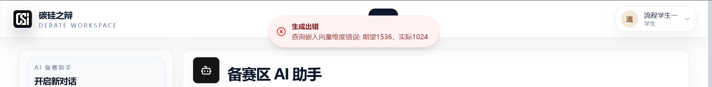
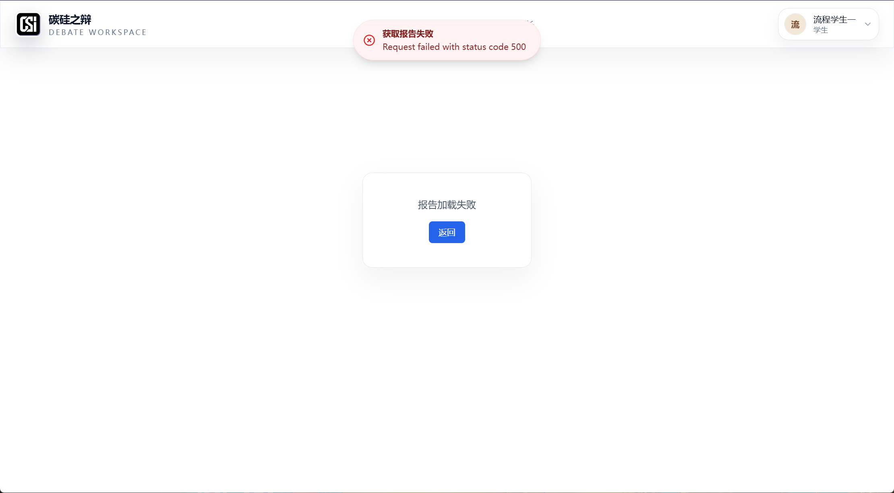

# 辩论平台 Bug 汇总与修复优先级报告

> 项目：碳硅之辩（Debate Platform）  
> 报告日期：2026-07-17  
> 代码基线：`main` / `d6fb6c5e`（本地工作区包含未提交修改）  
> 依据：需求方端到端测试截图、运行现象、当前代码静态审计  
> 结论：**当前版本不具备稳定交付条件，应先关闭 P0 阻断项，再开展完整回归。**

## 1. 管理层摘要

本轮共整理 **18 项缺陷/风险**：P0 级 8 项、P1 级 8 项、P2 级 2 项。需求方已实际复现的核心阻断包括：报告读取 500、PDF 报告导出 500、备赛区 AI 助手向量维度不一致、以及页面右上角控件重叠。代码审计进一步发现，报告生成依赖进程内后台任务，失败后仍可能向前端广播“辩论已结束”；实时房间状态主要保存在单进程内存；模型配置存在“数据库旧配置覆盖环境变量新配置”的可能；上传文件通过静态目录直接暴露，缺少统一的对象级授权。

这些问题具有明显的链式效应：

1. 辩论结束后，后台评分或报告任务若丢失/失败，数据库中会出现“辩论已结束但评分、报告未就绪”的中间态。
2. 报告读取接口会尝试补评分，PDF 导出还会继续调用 Markdown 生成与 PDF 渲染；任一环节失败都会表现为 500。
3. 前端只展示 `Request failed with status code 500`，没有错误编号、任务状态或可重试提示，导致用户无法判断是配置、数据、模型还是渲染器问题。
4. 已存在的单元测试主要验证 mock 或局部合同，无法覆盖真实 Docker、数据库、模型、向量库、文件系统和浏览器交互组成的端到端链路。

## 2. 优先级定义

- **P0（阻断）**：核心流程不可用、数据一致性或安全风险；修复前不得发布。
- **P1（高）**：主要功能不稳定、结果可信度不足或明显影响教学使用；P0 后立即处理。
- **P2（中）**：体验、可维护性或可观测性问题；不阻断试运行，但必须进入迭代计划。

## 3. 需求方已复现问题

### BUG-UI-001：右上角用户卡片与校验提示重叠

- 优先级：**P1**
- 状态：已复现（需求方附件图1）
- 现象：教师端创建辩论页面右上角，用户信息卡片与“请输入辩论主题”等提示发生重叠，文字和图标互相遮挡。
- 影响：提示不可读；在较窄视口或不同缩放比例下可能进一步遮挡操作入口。
- 初步判断：固定定位元素共用右上角锚点，`z-index`、安全间距和响应式断点未统一。
- 建议修复：统一 Toast 容器位置；为顶部导航预留安全区域；在 1280、1440、1920 宽度及 100%/125% 缩放下回归。
- 验收标准：用户卡片、Toast、导航按钮在所有目标分辨率下无重叠，提示文本完整可读。

### BUG-RPT-001：完整报告/PDF 导出返回 500

- 优先级：**P0**
- 状态：已复现（需求方附件图2、图3）
- 现象：在报告总览或报告详情点击“下载完整报告/导出 PDF”后，前端提示“导出失败，Request failed with status code 500”。
- 影响：核心交付物无法下载；教师和学生无法留存、归档或提交结果。
- 已确认代码链路：报告导出依次依赖评分就绪、报告数据、Markdown 生成、PDF 渲染、缓存路径写入。
- 待日志确认的可能失败点：
  - 有效发言或评分不完整；
  - Markdown 模型返回空结果；
  - PDF 渲染器/字体/系统依赖不可用；
  - `UPLOAD_DIR/reports` 在容器中不可写或未持久化；
  - `report_markdown_hash`、`report_pdf_markdown_hash` 与缓存文件状态不一致。
- 验收标准：对同一场已完成辩论连续导出 3 次均返回 200；文件可打开、内容与页面一致；第二次以后命中有效缓存；失败时返回结构化错误码而非裸 500。

### BUG-RAG-001：备赛区 AI 助手向量维度不一致

- 优先级：**P0**
- 状态：已复现（证据图 A）
- 现象：备赛区 AI 助手发送消息后报错“查询嵌入向量维度错误：期望 1536，实际 1024”，AI 回复区域为空。
- 根因：数据库/配置仍按 1536 维建库或校验，而当前嵌入模型实际返回 1024 维。
- 影响：知识库检索和备赛问答完全不可用；已入库材料也可能无法查询。
- 建议修复：明确唯一嵌入模型和维度；启动时执行维度预检；迁移向量列并对全部文档重新向量化；禁止仅修改配置数字而不重建索引。
- 验收标准：启动健康检查报告模型维度、数据库向量列维度和样例请求维度完全一致；新旧文档均可检索；对话不出现空白机器人消息。

### BUG-RPT-002：分析报告读取/生成失败，页面返回 500

- 优先级：**P0**
- 状态：已复现（证据图 B、需求方附件图5）
- 现象：打开已完成辩论的分析报告时提示“获取报告失败，Request failed with status code 500”，页面仅显示“报告加载失败”。
- 影响：辩论结束后的复盘、能力分析、教师反馈和成长数据均无法使用。
- 与 BUG-RPT-001 的关系：二者共享评分和报告数据，但读取报告不应依赖 PDF 渲染；因此必须分别定位，不可仅修导出按钮。
- 验收标准：辩论结束后报告状态从 `processing` 明确转为 `ready` 或 `failed`；`ready` 时 GET 报告稳定返回 200；`failed` 时返回可诊断错误码并支持重试。

### BUG-UX-001：前端错误提示缺少可诊断信息

- 优先级：**P2**
- 状态：已复现（多张截图）
- 现象：界面直接显示 Axios 英文错误 `Request failed with status code 500`。
- 影响：用户不知道该重试、联系管理员还是补数据；项目人员无法通过截图快速定位后台日志。
- 建议修复：后端统一返回 `code/message/request_id/retryable/details`；前端显示中文业务提示和请求编号，隐藏技术堆栈。

## 4. 代码审计发现的问题

### P0：必须先修复的阻断项

#### BUG-SEC-001：密钥和密码已在聊天/截图中明文暴露

- 多组模型、语音、向量、数据库、Redis 和第三方平台凭据曾以明文出现在沟通截图中。
- 这些凭据应视为已泄露，不能继续用于测试或生产。
- 立即行动：全部吊销并重新生成；更新本地、服务器和 CI/CD Secret；删除历史明文；检查第三方调用和账单；禁止将真实 `.env` 纳入压缩包或版本库。

#### BUG-CFG-001：AI 配置可能被数据库旧值覆盖，环境变量更新不生效

- 代码证据：`ConfigService.get_model_config()` 优先返回缓存/数据库第一条配置；只有数据库无记录时才使用环境变量创建默认配置。
- 风险：即使服务器 `.env` 已更新 API Key，数据库中的空值或旧值仍可能继续生效；多处配置源导致“看起来配置过，运行时却未接上”。
- 建议：定义单一真相源；启动日志输出脱敏后的最终配置来源；更新配置后清缓存；增加模型、ASR、TTS、向量服务的启动预检。

#### BUG-RT-001：抢麦响应协议不完整，异常分支存在静默返回

- `request_recording` 已携带 `request_id` 并返回允许/拒绝，但 `grab_mic` 在房间不存在或找不到角色时直接返回，前端可能一直等待。
- 抢麦“先检查、后更新”未见原子锁；并发请求可能同时通过占用检查。
- 建议：所有分支必须返回带 `request_id` 的结果；使用房间级原子锁或 Redis 锁；把麦克风占用作为带版本号的状态更新。

#### BUG-RT-002：实时房间状态主要保存在单进程内存，重启/多实例会失真

- `DebateRoomManager.rooms` 是进程内字典；当前只对候场清单等少量元数据做数据库持久化。
- 风险：API 重启后房间、计时器、当前发言人、麦克风占用和流程阶段可能丢失；多 worker 会持有不同状态。
- 建议：持久化关键状态并增加版本号；使用 Redis/数据库作为共享状态；恢复时重建计时器；所有状态写入必须具备幂等性。

#### BUG-TASK-001：评分/报告使用进程内 `asyncio.create_task`，任务不可恢复

- 辩论结束后直接创建后台任务；进程退出、部署重启或异常会导致任务永久丢失。
- 后台异常只记录日志，`finally` 仍广播 `debate_ended`，前端容易误判报告已经准备完成。
- 建议：使用持久化任务队列；记录 `queued/running/ready/failed`、尝试次数、错误码和更新时间；提供幂等重试和补偿任务。

#### BUG-RPT-003：辩论结束状态与报告就绪状态混用

- “辩论已结束”不等于“评分完成/报告可读/PDF可导出”。当前广播时机无法表达这三个状态。
- 建议：拆分 `debate_status`、`scoring_status`、`report_status`、`export_status`；前端轮询或订阅状态，只有 `report_status=ready` 才开放报告入口。

#### BUG-UPL-001：上传文件经静态目录直接暴露，缺少对象级授权

- 已有 UploadGuard 做扩展名、大小、MIME/魔数等校验，但 `api/main.py` 仍将整个上传目录挂载为 `/uploads` 静态资源。
- 风险：只要猜到路径即可绕过业务权限访问文件；用户/班级/辩论归属未统一校验。
- 建议：上传文件使用随机不可预测对象键；下载必须经过鉴权路由；校验所有权、班级和角色；静态服务仅用于真正公开资源。

#### BUG-AI-001：端到端 AI 辩论缺少生产级健康门禁

- 单独模型调用成功不能证明“语音识别 → 人类文本 → 上下文组装 → AI 回答 → TTS/前端播放”全链路可用。
- 当前配置可由数据库、缓存和环境变量共同决定，外部服务失败还可能被回退逻辑掩盖。
- 建议：增加真实供应商的受控冒烟测试；每场辩论记录 provider/model/config_revision；AI 回复失败时明确标记，不得生成空白消息冒充成功。

### P1：核心流程稳定后立即处理

#### BUG-SCORE-001：批量评分当前主要是本地启发式，不是基于模型的语义评分

- `batch_score_debate()` 直接按字数、关键词、逻辑标记和阶段加权计算分数。
- 该机制可作为临时兜底，但不能声称是“AI 对论证内容的深度分析”。
- 建议：前端标记评分来源；模型评分失败时显示 `fallback`；关键教学报告应支持人工复核。

#### BUG-SCORE-002：模型异常时写入固定 70 分，可能把故障伪装为正常结果

- `score_speech()` 捕获异常后仍落库 70 分。
- 建议：失败记录应写 `status=failed/fallback`，而非无来源的正常分数；报告和能力图必须排除或显著标记兜底数据。

#### BUG-SCORE-003：评分记录缺少来源、量表版本和证据链字段

- `Score` 仅保存五维分数、总分和反馈，无法回答“谁评的、用哪个模型/量表、依据哪段发言、是否回退”。
- 建议增加 `provider/model/rubric_version/source/evidence/confidence/is_fallback/created_by_job_id`。

#### BUG-ANL-001：班级平均值按评分行加权，与学生等权平均可能不一致

- 学生排行先按学生聚合；班级平均直接对所有 `Score` 行求均值。发言更多的学生权重更高。
- 建议明确口径，并优先采用“先按学生聚合，再对学生等权平均”；页面展示样本人数、有效辩论数和统计周期。

#### BUG-ANL-002：“领先百分位”命名易误导

- 当前公式更接近排名百分比，第一名显示 100%，但“领先百分位”容易被理解为超过多少同学。
- 建议统一术语和公式，并在 UI 上给出样本量说明。

#### BUG-DATA-001：演示/种子评分可能污染正式能力图

- 仓库包含 `seed_fake_debate_report.py`、`seed_student_ability_portrait.py`、`seed_full_flow_demo.py` 等脚本。
- 若测试库与正式库未隔离，能力雷达图、排名和班级平均可能包含模拟数据。
- 建议为数据增加 `environment/source/is_demo`；生产查询强制排除演示数据；测试环境独立数据库。

#### BUG-JDG-001：裁判 JSON 修复失败路径可能触发异常变量作用域问题

- `first_error` 在 `except ... as first_error` 中捕获，后续第二个 `except` 再引用；Python 会在异常块结束后清理该变量，可能引发 `UnboundLocalError`。
- 建议在异常块外显式初始化并保存字符串；为“首次解析失败 + 修复再次失败”增加单元测试。

#### BUG-TST-001：测试通过但端到端仍失败，测试门禁不完整

- 现有测试较多依赖 mock，能证明局部函数和接口合同，但未覆盖真实 Docker、PostgreSQL/pgvector、模型、PDF 渲染器、文件权限和浏览器下载。
- 建议建立最小 E2E：注册/登录 → 创建班级和学生 → 创建辩论 → 人类发言 → AI 回应 → 结束 → 评分 → 报告读取 → PDF 导出 → 成长数据更新。

### P2：体验与治理项

#### BUG-FILE-001：报告/上传文件路径可预测且依赖本地文件系统

- 文件名包含辩论 ID，且缓存落本地目录；在多实例或容器重建后可能缺失。
- 建议使用对象存储或共享卷，下载使用短时签名/鉴权，缓存记录加入校验和和存储版本。

## 5. 推荐修复顺序

### 第一批：当天止血（P0 安全和配置）

1. 轮换所有已暴露密钥和密码，清理明文。
2. 固化模型/ASR/TTS/向量配置来源，增加启动预检。
3. 修复 1536/1024 向量维度并重建向量索引。

### 第二批：恢复核心闭环（P0 报告和 AI）

1. 给评分、报告和导出增加独立状态与结构化错误码。
2. 将后台评分/报告迁移到可恢复任务队列，补齐失败重试。
3. 修复报告 GET 500、PDF 导出 500，并验证容器内渲染和目录权限。
4. 完成真实“人类发言 → AI 理解并回应”的端到端测试。

### 第三批：保证实时可靠性（P0/P1）

1. 统一录音/抢麦请求响应协议。
2. 加房间级并发锁和状态版本。
3. 将关键实时状态迁移到共享存储并支持重启恢复。
4. 上传下载改为鉴权路由，关闭敏感目录直接静态暴露。

### 第四批：提升分析可信度（P1）

1. 标记评分来源和回退状态，停止把固定 70 分当成正常分。
2. 增加量表版本、证据锚点和模型版本。
3. 隔离演示数据；统一班级平均与百分位口径。

### 第五批：UI 与可观测性（P1/P2）

1. 修复右上角重叠和响应式布局。
2. 所有 5xx 返回请求编号和中文业务提示。
3. 建立 E2E 发布门禁和可复现测试数据集。

## 6. 发布验收清单

- [ ] 所有已暴露凭据已吊销并完成轮换。
- [ ] 启动健康页能显示脱敏后的模型来源、模型名、向量维度和外部服务状态。
- [ ] 备赛助手连续 20 次问答无空白回复、无维度错误。
- [ ] 一场真实辩论中，人类语音能转写，AI 能引用人类刚才的观点进行针对性回应。
- [ ] 同一房间 2 个客户端并发抢麦只允许 1 个成功，失败方立即收到明确响应。
- [ ] API 重启后房间关键状态可恢复，不能跳阶段或丢失当前发言人。
- [ ] 辩论结束后评分和报告状态可追踪，任务失败可重试且不重复写分。
- [ ] 已完成辩论的报告 GET 稳定返回 200；报告内容包含真实发言证据锚点。
- [ ] PDF 连续导出 3 次成功，文件可打开，缓存命中正确，容器重启后仍可访问。
- [ ] 不同学生不能通过猜测 URL 下载他人上传材料或报告。
- [ ] 能力图只统计正式、有效、非回退评分；页面显示样本量、统计周期和评分来源。
- [ ] 1280/1440/1920 宽度及 100%/125% 缩放下顶部控件无重叠。

## 7. 责任人建议与工期口径

| 模块 | 建议责任人 | 预计工作量 | 前置依赖 |
|---|---|---:|---|
| 密钥轮换与配置收口 | 后端/运维 | 0.5–1 天 | 第三方控制台权限 |
| 向量维度迁移与重建 | 后端/数据 | 1–2 天 | 明确嵌入模型 |
| 报告读取与 PDF 导出 | 后端 | 2–4 天 | 模型、渲染器、存储可用 |
| 后台任务持久化 | 后端/运维 | 2–4 天 | Redis/任务队列方案 |
| 实时状态与并发锁 | 后端 | 3–5 天 | 共享状态方案 |
| 上传下载鉴权 | 后端/前端 | 1–3 天 | 文件存储方案 |
| AI 全链路 E2E | 后端/测试 | 2–3 天 | 可用测试账号和额度 |
| 评分可信度与能力图 | 算法/后端/产品 | 3–6 天 | 评分量表冻结 |
| 页面重叠与错误提示 | 前端 | 0.5–1.5 天 | 统一错误合同 |

> 工期为问题关闭的粗略量级，不含需求变更、数据迁移量和第三方服务审批时间。

## 8. 证据说明与限制

- 截图现象均来自需求方 2026-07-17 端到端测试；图1—图5应随本报告一并归档。
- 本报告对“向量维度不一致”给出确定根因；对报告读取/导出 500 给出已确认链路和高概率失败点，但最终根因仍需结合 API 容器日志、请求编号、数据库报告状态和文件系统权限确认。
- 本次未修改业务代码，仅整理缺陷、风险、优先级和验收标准。
- 代码基线存在未提交修改，正式修复前应冻结版本并记录部署对应的 commit/image digest。

