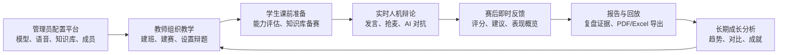

# 碳硅之辩：大模型驱动的人机辩论辅助教学平台完整功能说明

## 1. 文档定位

本文档用于说明“碳硅之辩：大模型驱动的人机辩论辅助教学平台”的完整功能设计，包括平台定位、角色权限、教学流程、学生端功能、教师端功能、管理员端功能、实时辩论功能、AI 辅助教学功能、报告回放功能和典型使用流程。

本文档面向比赛评审、课程教师、项目开发人员和后续维护人员，重点回答三个问题：

1. 平台解决什么教学问题。
2. 不同角色在平台中可以完成哪些操作。
3. 平台如何把 AI 能力转化为可落地的教学辅助功能。

## 2. 平台概述

“碳硅之辩”是一套面向课堂教学、AI 素养训练和辩论能力培养的智能辩论教学平台。平台以“教师组织课堂、学生参与辩论、AI 智能体陪练、系统自动分析复盘、知识库辅助备赛”为核心，将传统辩论教学中分散的组织、训练、评价、复盘环节整合为一套数字化系统。

平台不是普通在线会议工具，也不是单纯的聊天机器人。它围绕辩论教学场景设计，支持教师发布辩题和组织学生，支持学生与 AI 辩手进行完整流程的实时辩论，支持系统自动记录发言、生成报告、回放过程、分析成长，并通过课程知识库帮助学生进行赛前准备。

## 3. 教学问题与功能回应

| 教学痛点 | 平台功能回应 |
| --- | --- |
| 课堂辩论组织成本高，学生人数多时难以频繁开展 | 教师端支持班级、学生、辩论任务、预约辩论统一管理 |
| 学生缺少稳定对手和高频练习机会 | AI 辩手可作为反方队伍参与完整辩论流程 |
| 学生备赛资料分散，论据准备效率低 | 知识库与备赛助手支持基于课程材料的检索增强问答 |
| 传统课堂难以完整记录发言过程 | 实时辩论场自动沉淀文本、音频、角色、时长等记录 |
| 赛后评价依赖教师人工回忆，反馈不够及时 | 系统生成即时分析、正式报告、评分和改进建议 |
| 学生长期成长难以追踪 | 学生分析中心展示历史记录、成长趋势、班级对比和成就 |
| AI 工具直接进入课堂容易失控 | 平台将 AI 限定在辩手、导师、裁判、知识库助手等教学角色中 |

## 4. 用户角色与权限

平台包含学生、教师、管理员三类核心角色。

| 角色 | 定位 | 主要权限 |
| --- | --- | --- |
| 学生 | 训练参与者 | 加入课堂、完成能力评估、参与辩论、使用备赛助手、查看个人报告和成长分析 |
| 教师 | 教学组织者 | 创建班级、管理学生、创建辩论、管理预约、查看报告回放、进行课堂复盘 |
| 管理员 | 平台维护者 | 管理班级和用户、维护知识库、配置模型、语音、向量、Coze、邮件等系统能力 |

## 5. 教学闭环流程

平台功能围绕“课前、课中、课后、长期追踪”四个阶段展开。

完整使用流程如下：

1. 管理员完成模型、语音、向量、知识库和成员数据配置。
2. 教师创建班级，添加或管理学生。
3. 教师创建辩论任务，设置辩题、知识点、时长、轮次和参与学生。
4. 学生登录平台，进入学生个人控制台。
5. 学生通过任务入口或邀请码加入辩论活动。
6. 学生完成能力评估，查看能力画像和角色分配。
7. 学生进入候场、匹配或房间等待页面。
8. 学生进入实时辩论场，与 AI 辩手完成标准辩论流程。
9. 系统记录发言文本、音频、角色、时长和阶段信息。
10. 辩论结束后生成即时分析、正式报告和回放记录。
11. 学生在分析中心查看历史记录、成长趋势、班级对比和成就。
12. 教师结合报告与回放开展课堂讲评和后续教学安排。

## 6. 学生端功能说明

学生端是平台的主要训练入口，围绕个人学习和辩论训练过程设计。

### 6.1 登录与个人身份进入

学生通过登录入口进入平台。登录成功后，系统根据角色自动跳转到学生个人控制台。学生端页面受到角色权限保护，未登录或非学生账号无法进入学生训练页面。

主要功能包括：

- 学生账号登录。
- 个人资料查看与修改。
- 密码修改。
- 头像和基础信息维护。
- 进入学生首页、设置页、分析中心、备赛助手、辩论场等页面。

### 6.2 学生个人控制台

学生个人控制台是学生登录后的核心首页，承担“学习仪表盘”和“任务入口”的作用。

主要内容包括：

| 功能 | 说明 |
| --- | --- |
| 当前学习状态 | 展示欢迎信息、个人状态和学习概况 |
| 辩论任务入口 | 展示当前或近期可参与辩论 |
| 邀请码加入 | 支持通过课堂邀请码加入教师发布的活动 |
| 历史记录入口 | 快速进入已完成辩论的报告和回放 |
| 成长概览 | 展示总场次、表现数据、能力变化等概况 |
| 知识库文档 | 展示课程资料，支持搜索、筛选、预览和下载 |
| 快捷入口 | 进入备赛助手、匹配大厅、分析中心和设置页 |

### 6.3 能力评估与能力画像

学生在参赛前可完成能力评估，形成基础能力画像。能力评估结果用于帮助学生理解自身训练起点，也可辅助角色分配和后续成长分析。

能力画像可围绕以下维度展开：

| 维度 | 说明 |
| --- | --- |
| 逻辑论证 | 观点结构、论证链条、因果关系表达 |
| 资料整合 | 对课程材料、案例和论据的吸收能力 |
| 反驳应变 | 对对方观点的识别、回应和反制能力 |
| 语言表达 | 发言清晰度、表达完整性和节奏控制 |
| 团队协作 | 与队友角色配合和整体策略意识 |

页面功能包括：

- 能力自评提交。
- 能力雷达图展示。
- 已评估结果查看。
- 推荐或分配辩手角色展示。
- 一辩、二辩、三辩、四辩职责说明。

### 6.4 辩论参与与候场

学生加入辩论活动后，会进入候场或匹配确认流程。该流程用于在正式辩论前确认辩题、队伍、角色和参与状态。

主要功能包括：

- 查看当前辩题。
- 查看参赛状态。
- 查看队伍成员。
- 查看自己被分配的辩手角色。
- 查看 AI 对手信息。
- 等待教师或系统开始辩论。
- 进入正式辩论场。

### 6.5 匹配大厅与自发组队

除教师发布的课堂辩论外，平台支持学生自发组队和进入匹配大厅，满足课外练习和自主训练需求。

主要功能包括：

| 功能 | 说明 |
| --- | --- |
| 查看大厅房间 | 学生可查看当前可加入的练习房间 |
| 创建房间 | 学生可创建自发组队房间 |
| 加入房间 | 学生可进入已有房间等待组队 |
| 房间详情 | 查看房间成员、辩题、状态和进入条件 |
| 等待进入辩论 | 成员就绪后进入正式辩论流程 |

该功能回应了学生“想练但缺少教师统一组织或同伴临时不齐”的使用场景。

### 6.6 预约辩论参与

学生端支持查看教师创建的预约辩论邀请，并对邀请作出响应。

主要功能包括：

- 查看我的预约辩论赛。
- 接受或拒绝预约邀请。
- 预约辩论赛签到。
- 查看预约提醒。
- 在预约开始前确认辩题、时间和参与身份。

预约机制适合课前安排、课堂展示赛、分组训练和教师指定学生参与的场景。

### 6.7 实时辩论参与

实时辩论场是学生端最核心的训练功能。学生进入辩论场后，可以按照系统推进的辩论流程参与发言、回应、抢麦和总结。

主要功能包括：

| 功能 | 说明 |
| --- | --- |
| 阶段展示 | 展示当前环节，如立论、盘问、自由辩论、总结陈词 |
| 倒计时 | 展示当前环节或当前发言人的剩余时间 |
| 发言权限提示 | 明确当前可发言角色，避免无序发言 |
| 文本发言 | 学生可输入文本进行发言 |
| 语音发言 | 学生可录制语音，系统识别为文本并记录音频 |
| 自由辩论抢麦 | 在自由辩论阶段通过抢麦获得发言权 |
| 指定发言 | 在选择回答阶段按规则选择发言人 |
| 发言记录 | 实时显示双方发言文本、角色和时间顺序 |
| AI 发言展示 | 展示 AI 辩手生成的发言内容 |
| AI 语音播放 | 播放 AI 发言语音，增强真实对抗感 |
| 结束回合 | 当前发言完成后结束本回合 |

平台内置流程覆盖：

1. 立论阶段。
2. 盘问与回答阶段。
3. 攻辩小结。
4. 自由辩论。
5. 总结陈词。

### 6.8 备赛助手

备赛助手帮助学生在课前围绕辩题和课程知识进行准备。它基于平台知识库进行检索增强问答，避免学生只依赖泛化的大模型回答。

主要功能包括：

| 功能 | 说明 |
| --- | --- |
| 知识库问答 | 学生输入问题，系统基于课程资料生成回答 |
| 来源引用 | 展示回答所依据的文档来源或片段 |
| 命中状态 | 提示是否命中知识库资料 |
| 置信度信息 | 辅助学生判断回答可靠程度 |
| 常见问题提示 | 引导学生围绕论点、论据、反驳策略进行提问 |
| 会话历史 | 保存历史问答，便于继续备赛 |

典型提问场景包括：

- “这个辩题可以从哪些角度立论？”
- “有哪些课程材料可以支持正方观点？”
- “反方可能如何反驳这个论点？”
- “请帮我整理一段一辩开篇框架。”
- “这个概念在课程材料中是怎么定义的？”

### 6.9 辩论报告

辩论结束后，学生可以查看单场辩论报告。报告用于呈现本场训练结果，是学生复盘的重要材料。

报告内容包括：

- 辩题与比赛基础信息。
- 学生个人表现总结。
- 能力维度评分。
- 发言表现分析。
- 优势与不足。
- 改进建议。
- 关键发言回顾。
- PDF 导出。
- Excel 导出。
- 邮件发送报告。

### 6.10 辩论回放

回放页面用于还原已完成的辩论过程。

主要功能包括：

- 查看辩题和比赛时间。
- 查看人类学生队伍和 AI 辩手队伍。
- 按时间顺序查看完整发言记录。
- 播放有音频记录的发言。
- 从报告或历史记录进入回放。

回放功能为课堂点评提供证据，也帮助学生回看自己的表达细节。

### 6.11 学生分析中心

学生分析中心用于展示长期学习数据，帮助学生理解自己在多场辩论中的变化。

主要模块包括：

| 模块 | 说明 |
| --- | --- |
| 历史记录 | 展示参加过的辩论，支持进入报告和回放 |
| 成长趋势 | 展示能力、得分、参与次数等变化 |
| 对比分析 | 展示个人与班级平均水平或排行榜的对比 |
| 成就徽章 | 展示已获得和待解锁的成就 |

该模块将单场训练转化为长期成长档案，适合课程过程性评价和学生自主复盘。

## 7. 教师端功能说明

教师端承担课堂组织、任务发布、过程管理和赛后讲评职责。

### 7.1 教师控制台

教师登录后进入教师控制台。控制台集中展示教师管理的班级、学生、辩论任务和统计概况。

主要功能包括：

- 查看教师控制台统计数据。
- 查看班级数量、学生数量、辩论任务数量等概况。
- 进入班级管理、学生管理、辩论管理、预约管理等模块。
- 从历史辩论进入报告、回放和分析页面。

### 7.2 班级管理

教师可以创建和管理自己负责的班级。

主要功能包括：

| 功能 | 说明 |
| --- | --- |
| 创建班级 | 设置班级名称、课程归属等基础信息 |
| 查看班级列表 | 查看教师负责的班级 |
| 班级统计 | 查看班级人数、活动数量等概况 |
| 班级码使用 | 支持学生通过邀请码或班级码加入活动 |

### 7.3 学生管理

教师可以围绕班级管理学生数据。

主要功能包括：

- 添加学生。
- 查看学生列表。
- 查看学生所属班级。
- 查看学生参与状态和训练数据。
- 为辩论任务选择参与学生。

### 7.4 辩论任务创建

教师可以创建正式辩论任务，用于课堂训练或课程活动。

可配置内容包括：

| 配置项 | 说明 |
| --- | --- |
| 所属班级 | 指定辩论面向哪个班级 |
| 辩论主题 | 设置本场辩题 |
| 支撑知识点 | 关联课程知识点或教学内容 |
| 参与学生 | 选择参与本场辩论的学生 |
| 时长设置 | 配置辩论时长或阶段时长 |
| 轮次设置 | 设置辩论轮次或训练次数 |
| 发布状态 | 决定是否发布为学生可参与任务 |

创建完成后，学生可以在学生端查看并加入对应辩论。

### 7.5 辩论任务管理

教师可以查看、更新和管理已创建的辩论任务。

主要功能包括：

- 查看辩论列表。
- 查看辩论详情。
- 更新辩论配置。
- 查看参与学生。
- 进入辩论场。
- 查看赛后分析。
- 查看正式报告。
- 查看辩论回放。

### 7.6 预约辩论管理

教师端支持创建和管理预约辩论赛，适合课前安排、展示赛、分批训练等场景。

主要功能包括：

| 功能 | 说明 |
| --- | --- |
| 创建预约 | 设置预约辩题、时间、参与对象 |
| 查看预约列表 | 管理已创建的预约辩论 |
| 查看预约详情 | 查看参与学生、邀请状态、签到状态 |
| 更新预约 | 调整预约信息 |
| 取消预约 | 对无法进行的预约辩论进行取消 |
| 查看学生响应 | 了解学生接受、拒绝或待响应状态 |

### 7.7 支撑文档管理

教师可为辩论任务关联支撑文档，用于提供辩题背景、课程材料或参考资料。

主要功能包括：

- 查看某场辩论的支撑文档。
- 上传支撑文档。
- 删除不再使用的支撑文档。
- 将文档作为学生备赛和教师讲评的材料基础。

### 7.8 赛后讲评与教学复盘

教师可从教师端进入报告页、回放页和分析页，完成赛后讲评。

主要使用方式包括：

- 通过报告查看学生整体表现。
- 通过回放还原关键发言。
- 根据评分维度发现共性问题。
- 结合班级数据调整后续课程安排。
- 将优秀发言或典型问题用于课堂讲解。

## 8. 管理员端功能说明

管理员端负责平台级数据治理和能力配置，是平台稳定运行的基础。

### 8.1 管理员后台概述

管理员登录后进入后台管理页面。后台采用模块化管理方式，覆盖班级、用户、知识库、模型、语音、向量、Coze 和邮件等配置。

### 8.2 班级管理

管理员可以查看和维护全平台班级数据。

主要功能包括：

- 查看全部班级。
- 创建班级。
- 修改班级信息。
- 删除班级。
- 管理班级与教师、学生之间的关系。

### 8.3 成员管理

管理员可以统一管理平台用户。

主要功能包括：

- 查看教师账号。
- 查看学生账号。
- 创建或维护用户信息。
- 按角色区分用户。
- 支持平台级成员治理。

### 8.4 知识库管理

管理员负责维护平台知识库，为学生备赛助手和 RAG 问答提供内容基础。

主要功能包括：

| 功能 | 说明 |
| --- | --- |
| 文档上传 | 支持上传 PDF、DOCX、DOC 等课程资料 |
| 文档解析 | 将文档内容解析为可处理文本 |
| 文本切片 | 将长文档拆分为适合检索的片段 |
| 向量化 | 生成文本向量并写入向量数据库 |
| 状态管理 | 查看文档解析和向量化状态 |
| 删除文档 | 清理不再使用的知识库内容 |

### 8.5 模型配置

管理员可以配置通用大模型能力。

配置内容包括：

- 模型名称。
- API 地址。
- API Key。
- 温度参数。
- 最大 Token 数。
- 其他模型调用参数。

模型配置影响 AI 辩手、裁判、导师、备赛助手等生成类功能。

### 8.6 Coze 智能体配置

平台支持接入 Coze Bot，用于多角色智能体能力。

配置内容包括：

- 不同 AI 辩手的 Bot ID。
- 裁判 Bot ID。
- 导师 Bot ID。
- API Token。
- 调用参数。

通过该功能，平台可以将不同智能体角色交给不同 Bot 承担，使 AI 辩手的立场、风格和任务更加明确。

### 8.7 ASR 语音识别配置

ASR 配置用于学生语音发言识别。

配置内容包括：

- 语音识别服务地址。
- 语音识别模型名称。
- API Key。
- 识别参数。

该配置影响学生语音转文字、发言记录和赛后回放质量。

### 8.8 TTS 语音合成配置

TTS 配置用于 AI 发言语音输出。

配置内容包括：

- 语音合成服务地址。
- 语音合成模型名称。
- API Key。
- 语速、音色等参数。

该配置影响实时辩论场中 AI 辩手发言的声音表现。

### 8.9 向量配置

向量配置用于知识库检索。

配置内容包括：

- 嵌入模型名称。
- 向量维度。
- 检索 Top K。
- 相似度阈值。
- 索引相关参数。

平台会根据向量配置对齐知识库向量字段和索引结构，保证检索能力稳定。

### 8.10 邮件配置

邮件配置用于报告发送等辅助功能。

配置内容包括：

- SMTP 主机。
- SMTP 端口。
- 发件邮箱。
- 账号与密码。
- 发件人显示信息。

### 8.11 配置可用性测试

管理员端可配合后端模型测试服务，对模型、语音或其他外部能力进行可用性验证，降低比赛演示或实际部署时因配置错误导致功能不可用的风险。

## 9. AI 辅助教学功能说明

平台将 AI 能力拆解到具体教学角色中，而不是让 AI 以单一聊天窗口形式出现。

### 9.1 AI 辩手

AI 辩手用于与学生进行实时对抗。当前平台默认场景中，人类学生作为正方，AI 辩手作为反方队伍参与辩论。

AI 辩手可以完成：

- 立论陈词。
- 盘问提问。
- 盘问回答。
- 自由辩论反驳。
- 攻辩小结。
- 总结陈词。
- 根据上下文回应学生观点。

### 9.2 AI 裁判

AI 裁判用于赛后评分和反馈生成。

可支持的评价方向包括：

- 观点是否清晰。
- 论据是否充分。
- 逻辑链条是否完整。
- 是否有效回应对方观点。
- 表达是否有结构。
- 是否存在跑题或无效重复。

### 9.3 AI 导师

AI 导师用于生成学习建议和教学反馈。

典型用途包括：

- 给学生提供改进建议。
- 总结本场表现亮点。
- 指出表达和论证短板。
- 为教师提供课堂讲评参考。
- 结合学生历史数据提示成长方向。

### 9.4 知识库助手

知识库助手用于课前备赛和课程资料问答。

它与普通大模型问答的区别在于：

- 优先检索课程知识库。
- 回答附带来源引用。
- 能显示命中状态和置信度。
- 更适合围绕课程材料和辩题背景进行准备。

## 10. 实时辩论场功能说明

实时辩论场负责执行完整人机辩论流程，是平台最具展示性的核心功能。

### 10.1 界面信息展示

页面展示内容包括：

- 辩论主题。
- 当前阶段。
- 阶段倒计时。
- 当前发言角色。
- 正方人类辩手区域。
- 反方 AI 辩手区域。
- 发言记录。
- 实时字幕。
- 音频播放状态。
- 控制按钮和辅助设置。

### 10.2 发言控制

平台根据辩论阶段控制发言权限。

| 发言模式 | 说明 |
| --- | --- |
| 固定发言 | 指定角色发言，如一辩立论、四辩总结 |
| 选择发言 | 某些盘问回答阶段允许在多个角色中选择发言人 |
| 自由抢麦 | 自由辩论阶段通过抢麦获得发言权 |

### 10.3 阶段推进

阶段推进由后端流程控制器统一管理，前端负责展示状态和响应操作。

阶段推进依据包括：

- 当前阶段时长。
- 发言人是否结束回合。
- AI 发言是否生成完成。
- AI 语音是否播放完成。
- 教师或系统是否触发下一阶段。

### 10.4 记录沉淀

辩论场会持续沉淀过程数据：

- 发言文本。
- 发言人身份。
- 正反方角色。
- 所属阶段。
- 发言时间。
- 发言时长。
- 音频文件地址。

这些数据用于报告、回放、评分和成长分析。

## 11. 报告、回放与成长分析功能

### 11.1 单场即时分析

辩论结束后，系统展示即时分析结果，帮助学生和教师快速了解本场表现。

内容包括：

- 本场概览。
- 关键指标。
- 发言表现。
- 优势总结。
- 改进建议。

### 11.2 正式辩论报告

正式报告更适合作为复盘材料和课程过程性评价材料。

内容包括：

- 辩论基本信息。
- 学生个人表现。
- 评分维度。
- 关键发言。
- 详细反馈。
- PDF 导出。
- Excel 导出。
- 邮件发送。

### 11.3 辩论回放

回放用于还原过程，适合教师课堂讲评和学生自查。

内容包括：

- 完整发言流。
- 发言角色与时间顺序。
- 音频播放。
- 人类队伍与 AI 队伍展示。

### 11.4 成长分析

成长分析面向长期训练。

内容包括：

- 历史比赛记录。
- 能力趋势。
- 班级对比。
- 排行或相对水平。
- 成就徽章。

## 12. 典型使用场景

### 12.1 人工智能通识课课堂辩论

教师围绕“AI 是否会削弱人的创造力”“大模型生成内容是否应被严格监管”等议题创建辩论任务。学生课前通过知识库助手准备论据，课中与 AI 辩手进行对抗，课后查看报告并完成复盘。

### 12.2 计算机基础课程中的思辨训练

教师围绕数据安全、算法推荐、网络隐私、数字素养等内容设置辩题。平台将技术知识与表达训练结合，帮助学生在理解技术概念的同时训练论证和反驳能力。

### 12.3 课外自主练习

学生在匹配大厅创建房间或加入房间，与同学或 AI 进行练习。该场景不依赖教师每次组织，适合高频低门槛训练。

### 12.4 教师课堂讲评

辩论结束后，教师打开报告和回放，选取关键发言进行点评，并根据数据发现班级共性问题，如论据不足、反驳弱、总结松散等。

### 12.5 比赛或课程展示

平台可用于展示“AI + 辩论教学”的完整链路：从建班建赛、学生参赛、人机对抗、语音交互，到赛后报告和知识库问答，形成完整演示闭环。

## 13. 功能边界与设计原则

### 13.1 功能边界

平台重点解决辩论教学和表达训练问题，不替代教师的教学判断，也不把 AI 评分作为唯一评价依据。AI 输出主要用于辅助训练、提供初步反馈和提高复盘效率，教师仍然是课堂评价和教学决策的核心主体。

### 13.2 设计原则

| 原则 | 说明 |
| --- | --- |
| 低操作门槛 | 学生和教师无需学习复杂流程即可完成参赛、建赛和查看报告 |
| 教师可控 | 辩题、学生、任务、资料和复盘节奏由教师组织 |
| AI 辅助而非替代 | AI 参与陪练、评价和建议，但不替代教师判断 |
| 过程可追溯 | 发言、音频、报告、评分和回放均可沉淀 |
| 反馈可行动 | 报告不仅给分，还要指出优势、问题和下一步改进方向 |
| 数据可成长 | 单场结果进入长期分析，支持过程性评价 |
| 配置可维护 | 模型、语音、向量和邮件等能力通过后台配置维护 |

## 14. 功能亮点总结

| 功能亮点 | 教学价值 |
| --- | --- |
| 人机实时辩论 | 在缺少完整对手队伍时也能开展高强度训练 |
| 标准化流程控制 | 避免课堂辩论变成无序聊天，保证训练规则清晰 |
| 语音识别与合成 | 提升辩论现场感，并为发言记录和回放提供基础 |
| 备赛知识库助手 | 将课程资料转化为可提问、可引用、可准备的学习资源 |
| 自动报告与回放 | 降低教师复盘成本，提高学生反馈及时性 |
| 成长趋势与成就 | 将一次性活动转化为长期能力培养 |
| 教师、学生、管理员三端协同 | 覆盖教学组织、学生训练和平台运维完整链路 |

总体来看，“碳硅之辩”以辩论教学为真实场景，将大模型、智能体、语音、知识库、实时通信和学习分析整合为一套完整平台。它既能服务课堂中的一次辩论活动，也能支撑长期表达能力、逻辑思维能力和 AI 素养的持续培养。
