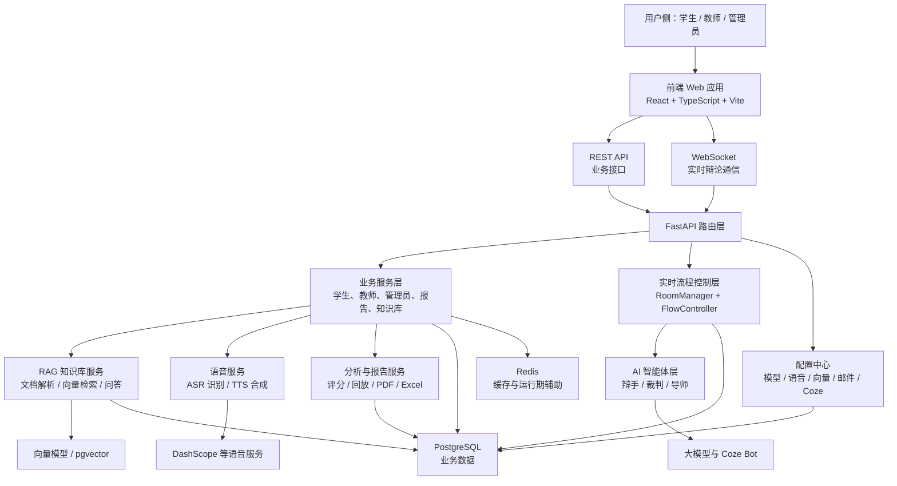
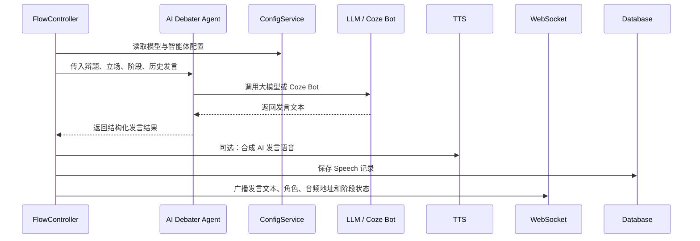
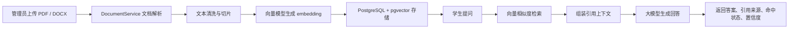
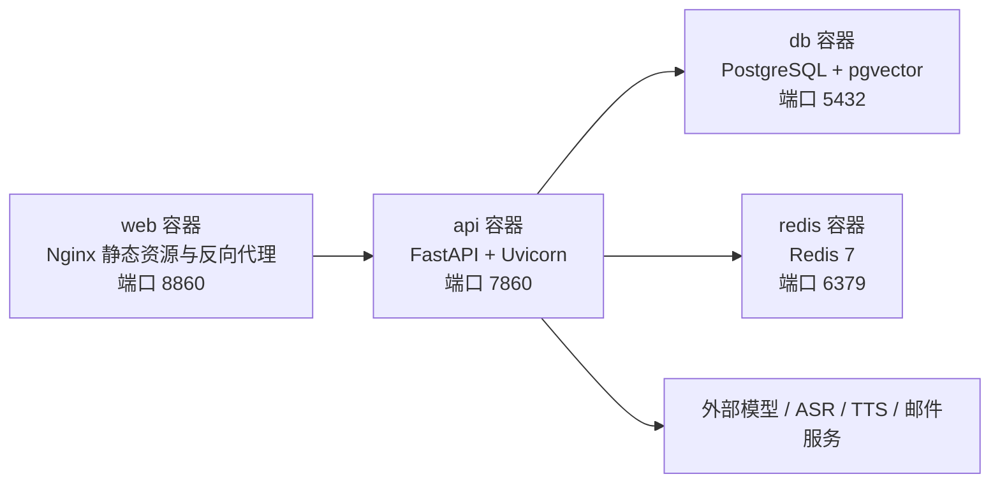

# 碳硅之辩：大模型驱动的人机辩论辅助教学平台完整架构说明

## 1. 文档定位

本文档用于说明“碳硅之辩：大模型驱动的人机辩论辅助教学平台”的系统架构、技术组成、模块边界、核心链路和部署方式，可作为中国大学生计算机设计大赛“微课与人工智能辅助教学”方向的设计与开发文档材料。

平台面向人工智能通识课、计算机基础课程、思辨表达训练课程等教学场景，核心目标是将“教师组织辩论、学生参与训练、AI 智能体实时陪练、知识库辅助备赛、赛后自动复盘、成长数据沉淀”整合为一套可运行、可扩展、可评估的教学平台。

## 2. 架构设计目标

| 目标 | 说明 |
| --- | --- |
| 教学流程闭环 | 支持课前备赛、课中辩论、课后复盘、长期成长追踪的完整过程 |
| 实时互动稳定 | 通过 WebSocket 支撑辩论房间状态同步、发言控制、阶段推进和 AI 发言广播 |
| AI 能力可替换 | 通过配置中心接入通用大模型、Coze 智能体、ASR、TTS、向量模型等能力 |
| 多角色协同 | 区分学生、教师、管理员三类角色，形成训练端、教学端、运维端协同体系 |
| 数据可沉淀 | 将发言、评分、报告、能力评估、知识库问答等数据持续保存，用于分析和复盘 |
| 工程可维护 | 采用前后端分离、业务分层、服务封装、配置外置、容器化部署的工程组织方式 |

## 3. 总体架构

系统采用前后端分离架构，整体由前端交互层、后端接口层、实时辩论编排层、AI 能力层、数据存储层、配置与部署层组成。



典型调用链路如下：

```text
浏览器前端
  -> REST API / WebSocket
  -> FastAPI 路由层
  -> 业务服务层 / 实时流程控制层
  -> AI Agent / RAG / ASR / TTS / 数据库
  -> REST 响应或 WebSocket 广播
  -> 前端刷新辩论状态、播放语音、展示报告与分析结果
```

## 4. 代码目录结构

| 目录或文件 | 作用 |
| --- | --- |
| `web/` | 前端工程，包含学生端、教师端、管理员端、辩论场、报告、回放、备赛助手等页面 |
| `api/` | 后端工程，包含 FastAPI 入口、路由、服务、模型、智能体、工具函数和测试 |
| `api/main.py` | 后端应用入口，负责注册路由、挂载静态目录、初始化数据库、Redis 和默认配置 |
| `api/routers/` | REST 与 WebSocket 路由层，按认证、学生、教师、管理员、语音、知识库拆分 |
| `api/services/` | 业务服务层，封装辩论、房间、评分、报告、分析、RAG、配置等业务逻辑 |
| `api/agents/` | AI 智能体层，包含 AI 辩手、裁判、导师等角色化 Agent |
| `api/models/` | SQLAlchemy 数据模型，定义用户、班级、辩论、发言、报告、知识库和配置等表 |
| `api/alembic/` | 数据库迁移脚本 |
| `api/tests/` | 后端测试用例 |
| `docker-compose*.yml` | 本地与容器化部署编排 |
| `Dockerfile.api` / `Dockerfile.web` / `Dockerfile.db.local` | 后端、前端、数据库镜像构建文件 |

## 5. 前端架构

前端位于 `web/`，基于 React 18、TypeScript、Vite、Tailwind CSS 构建，承担角色化页面展示、交互控制、REST 调用和 WebSocket 实时通信。

### 5.1 前端技术栈

| 技术 | 作用 |
| --- | --- |
| React 18 | 构建组件化页面和交互界面 |
| TypeScript | 提供类型约束，提升页面与服务调用的可维护性 |
| Vite | 前端开发、构建和预览工具 |
| Tailwind CSS | 页面样式、布局和响应式设计 |
| Radix UI | Dialog、Tabs、Tooltip、Select 等基础交互组件 |
| lucide-react | 图标系统 |
| Axios | REST API 请求封装 |
| WebSocket | 实时辩论状态、发言、抢麦、阶段推进等消息同步 |
| Vitest / Testing Library / fast-check | 前端单元测试、组件测试和属性测试 |

### 5.2 前端页面组织

前端路由集中在 `web/src/components/app-router.tsx`，按用户角色与业务场景组织页面。

| 页面模块 | 代表组件 | 说明 |
| --- | --- | --- |
| 公共入口 | `public-entry.tsx`、`login-portal.tsx` | 平台入口、登录、角色分流 |
| 学生首页 | `student-command-center.tsx` | 学生个人控制台，展示任务、报告、成长、知识库入口 |
| 学生竞赛中心 | `student-competition-hub.tsx` | 展示可参与辩论、比赛状态和参赛入口 |
| 学生能力评估 | `student-onboarding.tsx` | 能力自评、候场、角色确认 |
| 匹配大厅 | `debate-lobby.tsx`、`lobby-room-waiting.tsx` | 学生自发组队、加入房间、等待进入辩论 |
| 实时辩论场 | `debate-arena.tsx` | 辩论流程、发言、抢麦、语音、AI 对抗 |
| 赛后分析 | `enhanced-debate-analytics.tsx` | 单场辩论即时分析与反馈 |
| 学生分析中心 | `student-analytics-center.tsx` | 历史记录、成长趋势、班级对比、成就 |
| 报告与回放 | `debate-report-page.tsx`、`debate-replay-page.tsx` | 单场报告、PDF 导出、完整发言回放 |
| 备赛助手 | `student/preparation-assistant-page.tsx` | 基于知识库的问答、引用来源和会话历史 |
| 教师控制台 | `teacher-dashboard.tsx` | 班级、学生、辩论任务、预约辩论、报告回放 |
| 管理员后台 | `admin-dashboard.tsx` | 用户、班级、知识库、模型、语音、向量、邮件配置 |

### 5.3 前端布局与鉴权

前端通过布局组件区分不同角色的使用空间：

| 布局组件 | 作用 |
| --- | --- |
| `PublicLayout` | 公共入口与登录前页面 |
| `StudentLayout` | 学生端学习工作台 |
| `TeacherLayout` | 教师端教学组织工作台 |
| `AdminLayout` | 管理员后台 |
| `SettingsLayout` | 用户资料与能力设置 |
| `DebateFullscreenLayout` | 实时辩论全屏场景 |

鉴权由 `auth-guards.tsx` 提供，主要包括：

- `RequireAuth`：要求用户已登录。
- `RequireGuest`：限制已登录用户重复进入登录页。
- `RequireRole`：根据学生、教师、管理员角色控制页面访问。
- `RequireStudentAssessment`：要求学生完成必要能力评估后再进入正式辩论流程。

### 5.4 前端服务层

前端通过 `web/src/services/*.ts` 和 `web/src/lib/api.ts` 封装接口调用，避免页面组件直接拼接请求细节。WebSocket 客户端逻辑由 `web/src/lib/websocket-client.ts` 与 `web/src/hooks/use-websocket.ts` 支撑，负责连接、消息收发、状态更新和断线处理。

## 6. 后端架构

后端位于 `api/`，基于 FastAPI 构建，采用“路由层 + 服务层 + 智能体层 + 数据模型层 + 工具层”的分层方式。

### 6.1 后端技术栈

| 技术 | 作用 |
| --- | --- |
| FastAPI | REST API 与 WebSocket 服务 |
| Uvicorn | ASGI 运行服务器 |
| SQLAlchemy 2.x | ORM 与数据库访问 |
| Alembic | 数据库迁移管理 |
| PostgreSQL | 主业务数据库 |
| pgvector | 知识库向量存储和相似度检索 |
| Redis | 缓存和运行期辅助组件 |
| Pydantic / pydantic-settings | 数据校验、请求响应模型和配置管理 |
| python-jose | JWT 令牌签发和校验 |
| passlib / bcrypt | 密码哈希与账号安全 |
| httpx | 异步调用外部模型、语音和智能体服务 |
| pytest / pytest-asyncio / hypothesis | 后端测试体系 |

### 6.2 路由层

| 路由文件 | 主要职责 |
| --- | --- |
| `auth.py` | 注册、登录、当前用户信息、资料更新、密码修改、账号注销 |
| `student.py` | 学生能力评估、参赛、匹配大厅、预约响应、报告导出、历史、分析、成就 |
| `teacher.py` | 教师班级、学生、辩论任务、预约辩论、支撑文档管理 |
| `admin.py` | 管理员用户、班级、模型、语音、向量、邮件、Coze 等系统配置 |
| `admin_kb.py` | 管理员知识库文档上传、解析、切片、向量化和删除 |
| `student_kb.py` | 学生知识库问答、流式问答、会话历史 |
| `voice.py` | ASR 语音识别、TTS 语音合成、语音服务测试 |
| `websocket.py` | 实时辩论房间连接、消息接收和广播 |

### 6.3 服务层

| 服务文件 | 职责 |
| --- | --- |
| `auth_service.py` | 用户注册、登录、密码校验、令牌相关逻辑 |
| `student_service.py` | 学生端综合业务 |
| `class_service.py` | 班级创建、查询、统计与成员管理 |
| `debate_service.py` | 辩论任务创建、查询、更新和参与关系 |
| `room_manager.py` | 实时房间状态、参与者、麦克风和阶段状态管理 |
| `flow_controller.py` | 辩论流程编排、倒计时、发言权限、AI 发言触发 |
| `scoring_service.py` | 评分与评价生成 |
| `report_service.py` | 报告生成、PDF/Excel 导出、邮件发送支撑 |
| `analytics_service.py` | 学生分析、成长趋势、班级对比 |
| `comparison_service.py` | 对比分析 |
| `achievement_service.py` | 成就检测与成长激励 |
| `assessment_service.py` | 能力评估与能力画像 |
| `document_service.py` | 文档解析、文本清洗和切片 |
| `knowledge_base.py` | 知识库文档管理与检索 |
| `rag_service.py` | 检索增强生成问答 |
| `kb_vector_schema_service.py` | 向量列与索引结构自动对齐 |
| `config_service.py` | 模型、语音、向量、Coze、邮件配置读取 |
| `coze_client.py` | Coze Bot 调用封装 |
| `profile_service.py` | 用户资料与头像等个人信息维护 |
| `model_test_service.py` | 模型配置可用性测试 |

### 6.4 数据模型层

| 模型 | 作用 |
| --- | --- |
| `User` | 统一用户模型，覆盖学生、教师、管理员 |
| `Class` | 班级信息、班级码、教师归属等 |
| `Debate` | 辩论任务、辩题、状态、时长、轮次、知识点等 |
| `DebateParticipation` | 学生与辩论任务的参与关系、角色、队伍、状态 |
| `DebateReservationInvitation` | 预约辩论邀请、响应和签到状态 |
| `Speech` | 辩论发言记录、文本、角色、音频地址、时长 |
| `Score` | 单场评分、维度得分和反馈 |
| `AbilityAssessment` | 学生能力评估结果 |
| `Achievement` | 成就与成长激励数据 |
| `Document` | 支撑文档或教学文档记录 |
| `KBDocument` | 知识库文档元数据 |
| `KBDocumentChunk` | 文档切片、向量和检索字段 |
| `KBConversation` | 学生知识库问答会话历史 |
| `ModelConfig` | 通用大模型配置 |
| `CozeConfig` | Coze 智能体配置 |
| `AsrConfig` | 语音识别配置 |
| `TtsConfig` | 语音合成配置 |
| `VectorConfig` | 向量模型与检索配置 |
| `EmailConfig` | 邮件服务配置 |

## 7. 实时辩论架构

实时辩论是平台的核心链路，由前端辩论场、WebSocket 路由、房间管理器、流程控制器、AI 辩手、语音服务和数据存储共同组成。

### 7.1 WebSocket 接入

WebSocket 端点：

```text
/ws/debate/{room_id}?token={jwt}
```

连接建立时，后端完成以下动作：

1. 校验 JWT，确认用户身份。
2. 创建或加入对应辩论房间。
3. 获取当前房间状态、参与者、阶段、倒计时和发言权限。
4. 将初始状态推送给客户端。
5. 持续接收并处理发言、抢麦、阶段推进、音频播放状态等消息。

### 7.2 房间状态管理

`room_manager.py` 负责维护实时辩论房间的运行态数据，包括：

- 房间 ID 与辩论任务绑定关系。
- 正方人类辩手与反方 AI 辩手的参与者信息。
- 当前阶段、当前发言人、剩余时间。
- 抢麦状态、发言锁、选择发言人状态。
- 房间内客户端连接状态。

房间状态以运行期内存结构为主，并将关键发言与结果沉淀到数据库，兼顾实时性和可追溯性。

### 7.3 辩论流程编排

`flow_controller.py` 内置标准化辩论流程，覆盖立论、盘问、自由辩论、总结陈词等阶段。每个阶段包含：

| 字段 | 说明 |
| --- | --- |
| `id` | 阶段唯一标识 |
| `title` | 前端展示标题 |
| `phase` | 阶段类型，如立论、盘问、自由辩论、总结 |
| `duration` | 阶段时长 |
| `mode` | 发言模式，包含固定发言、选择发言、自由抢麦 |
| `speaker_roles` | 允许发言的角色列表 |

默认流程包括：

1. 正方一辩立论。
2. 反方一辩立论。
3. 多轮盘问与回答。
4. 双方攻辩小结。
5. 自由辩论抢麦。
6. 反方四辩总结陈词。
7. 正方四辩总结陈词。

当阶段进入 AI 发言角色时，流程控制器调用 AI 辩手生成内容，并通过 WebSocket 广播。当前端反馈 AI 语音播放完成后，系统再继续推进后续环节，避免“语音尚未播放完但流程已经跳转”的时序问题。

### 7.4 实时消息类型

| 消息类型 | 用途 |
| --- | --- |
| `speech` | 文本发言 |
| `audio` | 语音发言 |
| `grab_mic` | 自由辩论抢麦 |
| `select_speaker` | 选择回答阶段的发言人 |
| `start_debate` | 开始辩论 |
| `advance_segment` | 推进到下一阶段 |
| `end_turn` | 结束当前发言回合 |
| `end_debate` | 结束整场辩论 |
| `speech_playback_started` | 前端开始播放 AI 语音 |
| `speech_playback_finished` | 前端完成 AI 语音播放 |

## 8. AI 智能体架构

平台将大模型能力封装为多个教学角色，避免把 AI 仅作为普通聊天接口使用。

| 智能体 | 代码模块 | 主要职责 |
| --- | --- | --- |
| AI 辩手 | `agents/debater_agent.py` | 根据辩题、立场、阶段、上下文生成对抗性发言 |
| AI 裁判 | `agents/judge_agent.py` | 对辩论表现进行评分、评价和规则判断 |
| AI 导师 | `agents/mentor_agent.py` | 提供教学点评、改进建议和学习指导 |

### 8.1 智能体调用链路



### 8.2 AI 能力配置

AI 能力采用“数据库配置优先、环境变量兜底”的策略。管理员可以在后台维护：

- 通用大模型接口地址、模型名称、API Key、温度、最大 Token 数。
- Coze Bot ID、Token、不同辩手和导师/裁判角色配置。
- ASR、TTS 模型名称与接口参数。
- 向量模型、向量维度和检索参数。

这种设计使平台可以根据比赛演示、本地部署或学校私有化部署场景，灵活切换不同模型服务。

## 9. 语音链路架构

平台语音链路分为学生语音输入和 AI 语音输出。

### 9.1 ASR 语音识别

学生在实时辩论场中可以使用语音发言。系统通过 `voice.py` 和 `utils/voice_processor.py` 封装语音识别流程：

```text
学生录音或上传音频
  -> 前端发送音频数据
  -> 后端保存音频文件
  -> 调用 ASR 服务识别文本
  -> 保存文本、音频地址、发言时长
  -> 将识别文本纳入辩论上下文和赛后分析
```

### 9.2 TTS 语音合成

AI 辩手生成文本后，可以通过 TTS 合成语音，增强人机对抗的现场感：

```text
AI 生成发言文本
  -> 后端调用 TTS
  -> 生成音频文件
  -> WebSocket 广播文本和音频地址
  -> 前端播放 AI 发言
  -> 前端回传播放完成事件
  -> 后端推进下一环节
```

语音链路不仅提升体验，也为回放、时长统计和表达训练分析提供数据基础。

## 10. 知识库与 RAG 架构

知识库用于支撑学生课前备赛、论据查找、知识点解释和反驳策略准备。

### 10.1 文档处理链路



### 10.2 主要模块

| 模块 | 作用 |
| --- | --- |
| `admin_kb.py` | 管理员知识库上传、解析、状态查询、删除 |
| `student_kb.py` | 学生问答、流式回答、会话历史 |
| `document_service.py` | PDF/DOCX 解析、文本切片 |
| `knowledge_base.py` | 文档与切片管理、检索封装 |
| `rag_service.py` | 检索增强问答、引用来源组织 |
| `kb_vector_schema_service.py` | 自动对齐向量字段维度与索引 |
| `KBDocument` / `KBDocumentChunk` | 知识库文档与切片存储 |
| `KBConversation` | 问答历史记录 |

### 10.3 RAG 设计价值

平台不是让学生直接向通用大模型提问，而是优先基于课程文档、教学材料、辩题支撑材料进行检索增强回答。这样能够提高回答与课程内容的关联性，并通过来源引用降低“答案看似合理但无依据”的风险。

## 11. 报告与分析架构

赛后分析链路围绕发言记录、评分结果、能力画像和历史表现构建。

```text
辩论结束
  -> 汇总 Speech 发言记录
  -> 调用 ScoringService 生成评分与反馈
  -> 调用 ReportService 生成报告数据
  -> 调用 AnalyticsService 生成成长趋势与对比分析
  -> 前端展示即时分析、正式报告、回放与个人分析中心
```

| 模块 | 作用 |
| --- | --- |
| `scoring_service.py` | 评分维度、表现评价、建议生成 |
| `report_service.py` | 单场报告、PDF 导出、Excel 导出、邮件发送支撑 |
| `analytics_service.py` | 历史数据、成长趋势、班级对比 |
| `comparison_service.py` | 个人与班级、历史场次之间的对比 |
| `achievement_service.py` | 根据参与和表现数据触发成就 |
| `history_service.py` | 历史辩论记录查询 |

报告与分析结果面向两类使用场景：

- 学生用于自我复盘，理解本场表现、能力短板和改进方向。
- 教师用于课堂讲评，结合发言回放和数据指标指导后续教学。

## 12. 权限与安全架构

平台采用统一用户模型和角色权限控制。

| 角色 | 权限边界 |
| --- | --- |
| 学生 | 参与辩论、完成能力评估、查看个人报告、使用备赛助手、查看个人成长数据 |
| 教师 | 管理所负责班级和学生、创建辩论、查看相关报告与回放、创建预约辩论 |
| 管理员 | 管理全平台班级、用户、知识库和系统能力配置 |

安全设计包括：

- JWT 令牌认证，后端路由根据用户身份与角色校验权限。
- 密码使用哈希方式存储。
- 生产环境要求配置 `SECRET_KEY`、`DATABASE_URL` 等关键环境变量。
- CORS 支持通过 `ALLOWED_ORIGINS` 显式配置。
- 上传文件限制类型与大小，知识库文档限定为 PDF、DOCX、DOC 等教学资料格式。
- 模型、语音、邮件等密钥配置从后台或环境变量读取，避免写死在业务代码中。

## 13. 配置管理架构

系统配置分为三层：

| 配置来源 | 作用 |
| --- | --- |
| 环境变量 | 部署期基础配置，如数据库、Redis、密钥、外部服务默认地址 |
| 数据库配置表 | 运行期可维护配置，如模型、Coze、ASR、TTS、向量、邮件 |
| 代码默认值 | 开发环境和首次启动时的兜底默认配置 |

后端启动时会检查并创建默认模型配置、Coze 配置，同时尝试对齐知识库向量表结构。这样可以降低首次部署成本，并保证管理员后续能够在后台调整关键能力。

## 14. 部署架构

项目提供容器化部署方案，本地完整运行可由 Docker Compose 编排：



| 组件 | 说明 |
| --- | --- |
| `web` | 前端静态资源服务，默认映射到 `8860` |
| `api` | FastAPI 后端服务，默认映射到 `7860` |
| `db` | PostgreSQL + pgvector 数据库 |
| `redis` | Redis 缓存和运行期辅助服务 |

本地容器化运行时，API 启动命令会先执行数据库迁移，再启动 Uvicorn 服务：

```text
alembic upgrade head && uvicorn main:app --host 0.0.0.0 --port 7860
```

## 15. 测试与工程质量

项目包含前后端测试与质量工具。

| 类型 | 工具或位置 |
| --- | --- |
| 前端单元与组件测试 | Vitest、Testing Library、`web/src/**/*.test.tsx` |
| 前端属性测试 | fast-check |
| 后端接口与服务测试 | pytest、pytest-asyncio、Hypothesis、`api/tests/` |
| 数据库迁移 | Alembic |
| 类型检查 | TypeScript、mypy |
| 代码风格 | ESLint、Prettier、Biome 配置、Black、Flake8 |

测试覆盖的重点包括认证、用户模型、学生报告、知识库、RAG、语音处理、WebSocket、评分、配置服务、管理员接口、预约辩论数据一致性等模块。

## 16. 架构亮点总结

| 亮点 | 体现 |
| --- | --- |
| 教学业务深度建模 | 将辩论任务、参赛关系、发言、评分、报告、回放、成长分析拆成可追踪数据对象 |
| 实时辩论流程编排 | 通过 WebSocket、房间管理器和流程控制器实现标准化辩论进程 |
| 多智能体协作 | 将 AI 辩手、裁判、导师区分为不同角色，服务训练、评价和指导 |
| RAG 知识库支撑 | 管理员上传课程材料，学生备赛问答基于知识库检索增强生成 |
| 语音闭环完整 | 支持学生语音识别和 AI 语音合成，兼顾真实感、记录和复盘 |
| 三端协同 | 学生训练端、教师组织端、管理员配置端边界清晰 |
| 可配置与可部署 | 模型、语音、向量、邮件和 Coze 能力可后台配置，支持 Docker Compose 部署 |

总体来看，平台架构不是单点 AI 功能叠加，而是围绕“辩论教学”这一具体场景进行系统化设计：前端负责可操作的教学体验，后端负责稳定的业务编排和实时通信，AI 能力层提供智能陪练与评价，数据层沉淀训练证据，最终形成面向课堂教学的完整智能辅助平台。
